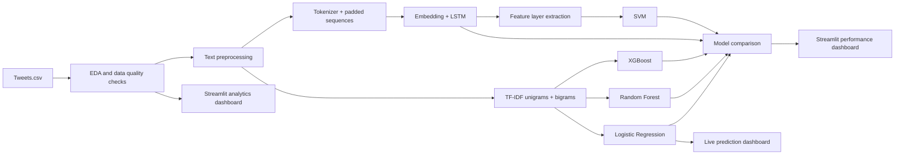

# Airline Twitter Sentiment Analytics Dashboard

An end-to-end NLP and analytics project that classifies airline tweets as positive or negative, explains customer feedback patterns, compares traditional machine learning with deep learning, and presents the results in an interactive Streamlit dashboard.

The project uses the Twitter US Airline Sentiment dataset, not the 1.6M-row Sentiment140 dataset. It is designed to train locally on a laptop and to report only metrics produced by your own run.

## Problem Statement

Airlines receive a constant stream of public customer feedback. Sentiment analysis helps teams identify unhappy customers, compare airline-level service perception, and understand recurring negative reasons such as delays, customer service issues, and lost luggage.

## Dataset

Use the Twitter US Airline Sentiment dataset and place the CSV at:

```text
data/Tweets.csv
```

Expected columns include:

- `text`
- `airline_sentiment`
- `airline`
- `negativereason`

This dataset has about 14,640 tweets, airline names, sentiment labels, and negative-reason categories, making it more realistic for local training and business analytics than very large generic tweet datasets. The dashboard can inspect every row, while model training filters out `neutral` rows and uses only `positive` and `negative` tweets.

## Architecture



## Tech Stack

- Python
- Pandas and NumPy
- Scikit-learn
- XGBoost
- TensorFlow/Keras
- Streamlit
- Matplotlib, Plotly, and WordCloud

## Project Structure

```text
project/
|-- app.py
|-- data/
|-- notebooks/
|-- models/
|-- src/
|   |-- preprocessing.py
|   |-- training.py
|   |-- evaluation.py
|   |-- visualization.py
|   `-- prediction.py
|-- train_logistic_regression.py
|-- train_random_forest.py
|-- train_xgboost.py
|-- train_lstm.py
|-- train_lstm_svm.py
|-- saved_models/
|-- reports/
|-- screenshots/
|-- requirements.txt
|-- README.md
`-- .gitignore
```

## Setup

```bash
python -m venv .venv
.venv\Scripts\activate
pip install -r requirements.txt
```

Add the dataset:

```text
data/Tweets.csv
```

## Google Colab Workflow

Upload the project folder to Google Drive or clone the repository in Colab. Then upload the Kaggle CSV as `data/Tweets.csv`.

Install dependencies:

```bash
!pip install -r requirements.txt
```

Train one model at a time:

```bash
!python train_logistic_regression.py
!python train_random_forest.py
!python train_xgboost.py
!python train_lstm.py
!python train_lstm_svm.py
```

The final command uses the saved LSTM model to extract dense features and trains an SVM on those features.

Train traditional machine learning models:

```bash
python -m src.training
```

Train LSTM and optional LSTM + SVM experiments:

```bash
python -m src.training --mode lstm
python -m src.training --mode hybrid
```

Run the dashboard:

```bash
streamlit run app.py
```

## Modeling Approach

Text preprocessing includes lowercasing, URL removal, mention removal, hashtag cleanup, punctuation removal, stopword removal, and whitespace normalization.

Traditional models use TF-IDF with unigrams and bigrams:

- Logistic Regression as the strong baseline.
- Random Forest to compare bagging-based ensemble learning.
- XGBoost to compare boosting against Random Forest.

Deep learning uses:

- Tokenizer
- Sequence conversion
- Padding
- Embedding layer
- LSTM
- Dense prediction layer

The optional hybrid experiment trains an LSTM, extracts vectors from the penultimate dense feature layer, then trains an SVM on those learned representations. This is treated as an experiment, not assumed to be better.

## Results

Run the training commands to generate real metrics in `reports/model_results.csv`.

| Model | Accuracy | Precision | Recall | F1 | Training Time |
| --- | --- | --- | --- | --- | --- |
| Logistic Regression | generated after training | generated after training | generated after training | generated after training | generated after training |
| Random Forest | generated after training | generated after training | generated after training | generated after training | generated after training |
| XGBoost | generated after training | generated after training | generated after training | generated after training | generated after training |
| LSTM | generated after training | generated after training | generated after training | generated after training | generated after training |
| LSTM + SVM | generated after training | generated after training | generated after training | generated after training | generated after training |

## Dashboard Pages

The Analytics Dashboard shows dataset statistics, missing values, sentiment distribution, airline sentiment comparison, negative reason analysis, tweet length distribution, frequent words, word clouds, and heatmaps.

The Model Performance Dashboard shows metric comparisons and confusion matrices from the generated reports.

The Live Prediction Dashboard accepts a custom tweet and returns the predicted sentiment, confidence score, and model used.

## What I Learned

- NLP preprocessing choices affect both interpretability and model performance.
- TF-IDF is a strong baseline because short tweets often contain sentiment-bearing keywords and phrases.
- Boosting can improve performance by combining many weak learners, though it may cost more training time.
- LSTM models use sequence order, which can help capture context that bag-of-words models ignore.
- Deep learning does not automatically outperform traditional ML on small datasets; results must be measured.
- LSTM + SVM is useful for understanding feature extraction and hybrid architectures, but its value depends on actual metrics.
- Business analytics can make a sentiment project more useful than a standalone classifier.

## Screenshots

Add screenshots to `screenshots/` after running the Streamlit app locally.
